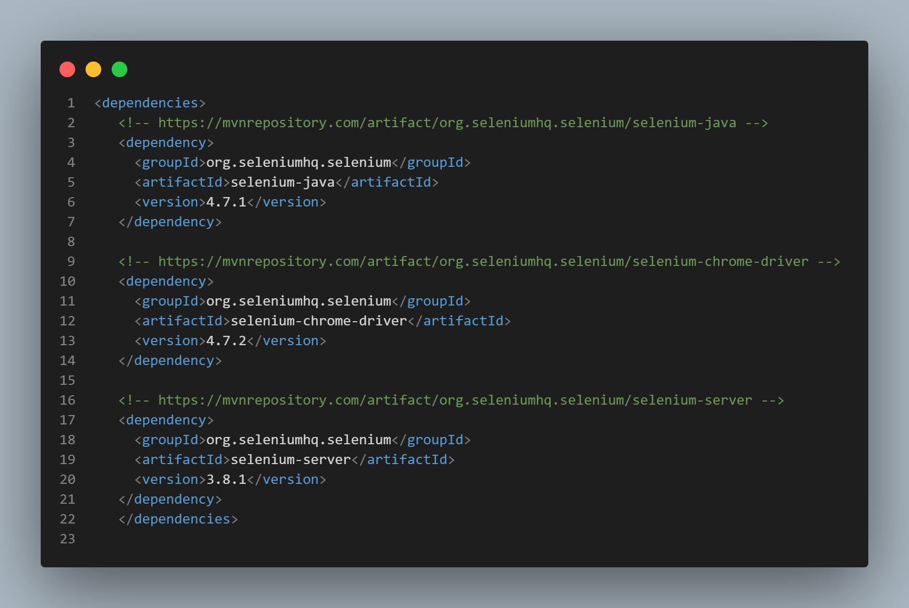

# Facade Design Pattern Demo

The purpose of this project is to demonstrate the Facade Design Pattern. As an object-oriented design pattern, the Facade Design Pattern simplifies the interface of complex systems of components. In this demo, we showcase how the Facade Design Pattern can be used to simplify interaction with a complex system of components.

># Lessons Learned

In this project, you will learn about the Facade Design Pattern and how it can be applied to simplify the interface of complex systems of components. You will learn about the benefits of using the pattern, including improved user experience, reduced complexity, and improved maintainability.

Specifically, you will learn:

1) What is the Facade Design Pattern?
2) When and how to apply the Facade Design Pattern
3) Best practices for using the Facade Design Pattern in your projects

># Prerequisites

Install the necessary dependencies (*Selenium* and *TestNG*) :




># Getting Started

- To get started with the project, follow these steps:

Clone the project

```bash
  git clone https://link-to-project
```

Go to the project directory

```bash
  cd my-project
```
```bash
Open the project in your preferred IDE(we recommend IntelliJ IDE)
```

># Sample Code

The project includes sample code that demonstrates how the Facade Design Pattern can be implemented in real-world scenarios. The code provides a practical example of how the pattern can be used to simplify the interface of complex systems of components.

># Feedback

We welcome your feedback and suggestions for improving the project. If you have any questions or feedback, please don't hesitate to reach out to us.

- [@Ahmed mohamed- Github](https://github.com/bego00)
- [@LinkedIn](https://www.linkedin.com/in/ahmed2mohamed/)
